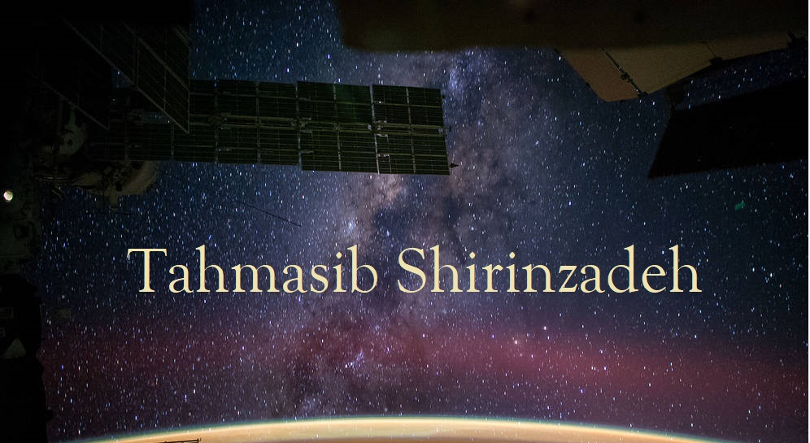

## Hi there 👋 I'm Tahmasib Shirinzadeh from Azerbaijan :azerbaijan:

I work as a front-end developer more than 2 years of experience. I discovered my passion for design and web development during university years.

➡️ In my current job I'm focused on **Vue/Vuex/Vue-router, AJAX, APIs, I use Sass, jQuery, NPM package manager, ESLint, Git version control** in projects. 
🔗 I am good at converting PSD file to HTML template, designing websites 
🌱 I’m currently learning Vue.js
✨ I'm well organized, self-motivated, strategic-planner
⚡ Fun fact: I am introvert

### Skills:

- HTML5
- CSS3 (Sass)
- Bootstrap4
- JavaScript ES6
- jQuery
- Vue.js (Vuex, Vue-router)
- RESTful APIs
- Gulp.js
- ESLint
- GIT version control
- NPM package manager
- Firebase: Authentication, Cloud Firestore
- Adobe Photoshop

---

### Get in touch

e-mail: shirinzadeh.tahmasib@gmail.com

twitter: https://twitter.com/tahmasibb

linkedin: https://www.linkedin.com/in/tahmasib-shirinzadeh/
-->

<!--
**shirinzadeh/shirinzadeh** is a ✨ _special_ ✨ repository because its `README.md` (this file) appears on your GitHub profile.

